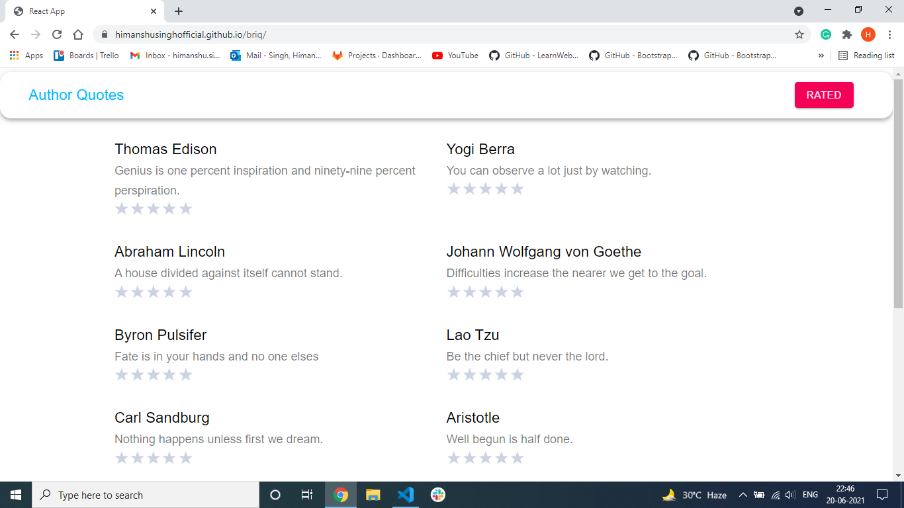

# briq-:mortar_board:

##Link (http://himanshusinghofficial.github.io/briq/)

Home Page : 
* The home page contains all the quotes fetching from API. 
* I am using infinite scroll. it makes the frontend load-free. at a time it fetches only 10-14 objects when the user scrolls again next 10-14 objects and so on
* I am using star rating npm for stars if the user rate quote 4 out of 5 or 5 out of 5 then the algorithm display similar quotes of user interest. 
* also, if the user rate quote 3,2,1 out of 5 then the algorithm display very different quotes as user disliked. 
* all these ratings get update and you can see them in your favorite section 

Rating Page : 

* User can see all his rated quotes in Top-Rated to Low-Rated manner. 
* also, update rating can also be added in the future easily.  

## `Made by: Himanshu Singh & Email:hs882677@gmail.com`

## `I Used` :smiley:  
1) ReactJs :heart: 
2) Material-ui/Css (Styling)  
3) Redux (for managing application state)  

## `Some ScreenShots` :camera:

#### `Image 1: Home Page`

#### `Image 2: Home Page Popup Notification`

#### `Image 3: Rating Page`

#### `Image 5: Rating Page Popup Notification`

### `Thanks You` :raised_hands:
